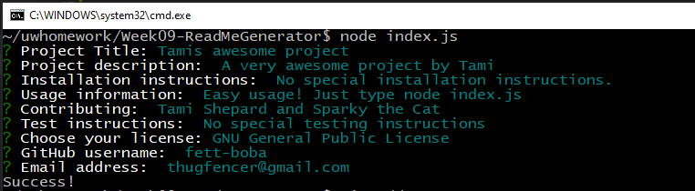
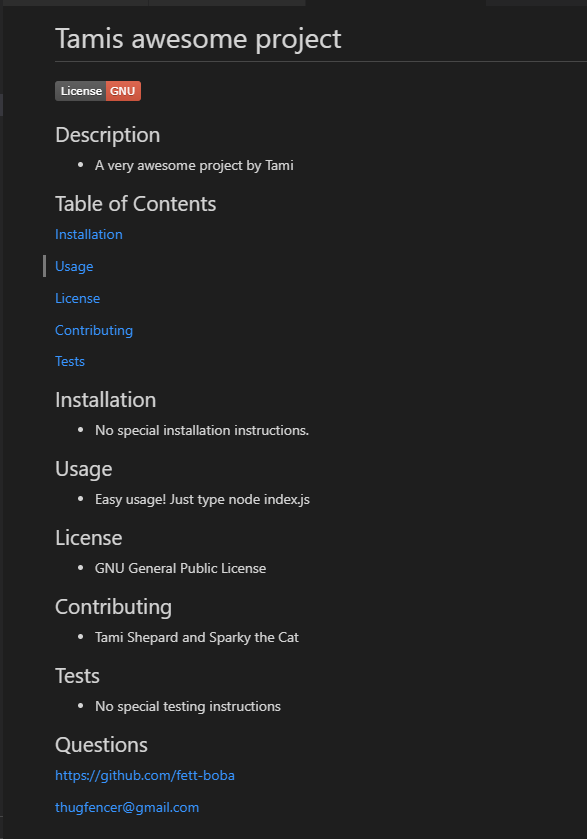

# Week09-ReadMeGenerator
Professional readme generator

## Description
- A command line README.md generator that accepts user input.  
- Will generate the following sections of a readme markdown file: Description, Table of Contents, Installation, Usage, License information, Contributors, Tests, and Questions.
- A license badge will be created and displayed.
- Link to GitHub page will be added to the "Questions" section.
- Email contact info will be added to the "Questions" section.
- README.md file will be generated as ./utils/README.md

## Table of Contents

[Installation](#installation)

[Usage](#usage)

[Contributing](#contributing)

[Tests](#tests)

## Installation

- README.md will be generated in the ./utils folder 

## Usage

- "node index.js" from the command line

## Contributing

- Tami Shepard.

## Tests

- Confirmed all sections created.
- Badge is displayed after the project Title
- Insured Table of Contects links work properly
- Link to GitHub created properly, and working
- Email contact works correctly and generates a mailto.

## Assets

## Questions

[https://github.com/fett-boba](https://github.com/fett-boba)

[thugfencer@gmail.com](mailto:thugfencer@gmail.com)

